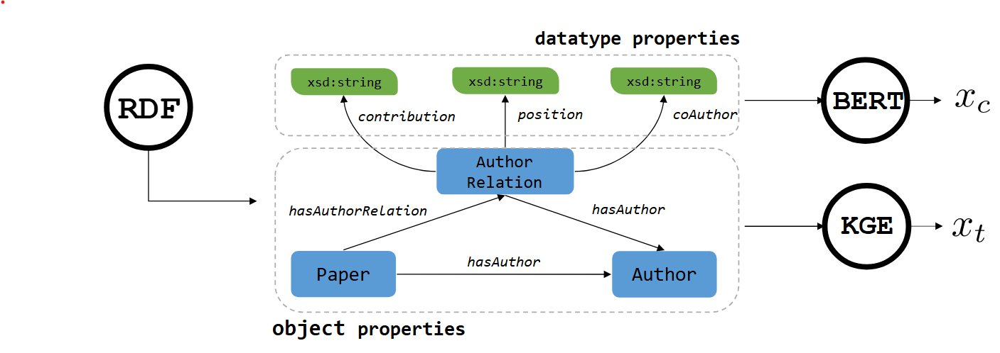

# Supplementary materials: 
## Benchmarking GNN-based Recommendation Systems with RDF Knowledge Graphs

This repository contains supplementary materials for evaluating the integration of RDF knowledge graphs and Graph Neural Networks (GNNs) to enhance recommendation systems across various scenarios, leveraging semantic and topological features extracted from RDF data.

---

## Evaluation Tasks and Scenarios

We evaluates three recommendation scenarios using RDF knowledge graphs from **SOA-SW** and **LPWC** datasets:

1. **[Paper Recommendation](./paper-recommendation)**  
   Recommends research papers by predicting links between author and works. In this scenario, we perform link prediction on
the _author-work_ edge using the **SOA-SW** dataset, experimenting with both full
heterogeneous graph setting (6 node types, 7 edge types) and bipartite graph
setting with only _author_ and _work_ nodes along with their connecting
edges (_author-work_ ).

2. **[Collaboration Recommendation](./collaboration-recommendation)**  
   Identifies potential research collaborators by predicting co-author relationships. In this scenario, link prediction is performed on the _author-author_ edge type using the **SOA-SW** dataset. This
scenario involves only _author_ nodes, and we experiment with the following settings: the heterogeneous setting uses the entire graph, while the homogeneous setting focuses on _author_ nodes and _author-author_ edges forming the co-author network.

3. **[Task Recommendation](./task-recommendation)**  
   Recommend research tasks by predicting links between _dataset_ and _task_ nodes. In this scenario, we perform link prediction on the _dataset-task_ edge type using the **LPWC** dataset, on both full heterogeneous
graph (4 node types, 6 edge types) and bipartite graph setting focusing on _dataset_ and _task_ nodes and their connecting edges.

---

### RDF to Heterogeneous Graphs Transformation
We employs [**AutoRDF2GML**](https://github.com/davidlamprecht/AutoRDF2GML) to transform RDF knowledge graphs into heterogeneous graph datasets. As illustrated in the figure below, AutoRDF2GML extracts the following two features:
- **Content-based Features  $x_c$**: Derived from RDF **datatype** properties e.g., _contribution_ and _coAuthor_. Depending on the type of the literal, AutoRDF2GML applies specific transformation rules, e.g., _string_ literals are transformed into numerical features using BERT-based embedding models.
- **Topology-based Features $x_t$**: Derived from RDF **object type** properties such as _hasAuthor_, generated using knowledge graph embedding models such as TransE, ComplEx, etc .

---

## Semantic Features

The primary objective of the evaluation is to benchmark widely-used GNN model architectures, including **GraphSAGE**, **GAT**, and **HGT**, in terms of their ability to effectively utilize semantic node features from RDF KGs for recommendation tasks. Additionally, we aim to identify the most effective approach for combining these diverse semantic features from RDF KGs to optimize the performance of the downstream recommendation systems. To achieve this, we evaluate several methods for semantic initialization and combination, as structured below (depending on whether GraphSAGE, GAT or HGT is used as GNN architecture):

| Script Name                                   | Description                                                                                     |
|----------------------------------------------|-------------------------------------------------------------------------------------------------|
| `01_one-hot-encoding-{graphsage/gat/hgt}.py` | Initializes node features using one-hot encoding for the specified GNN architecture. This serves as non-semantic baseline           |
| `02_nld-{graphsage/gat/hgt}.py`              | Incorporates node-level descriptors derived from natural language descriptions.                |
| `03_literals-{graphsage/gat/hgt}.py`         | Adds literal features (categorical, numeric, etc.) to enrich node representations.             |
| `04_transe-{graphsage/gat/hgt}.py`           | Utilizes TransE embeddings to encode topological properties.                                   |
| `05_nld-transe-{graphsage/gat/hgt}.py`       | Combines natural language descriptors and TransE embeddings.                                   |
| `06_combined-concatenated-{graphsage/gat/hgt}.py` | Combines features using concatenation.                                                         |
| `07_combined-addition-{graphsage/gat/hgt}.py` | Combines features using addition.                                                              |
| `08_combined-addition-weighted-{graphsage/gat/hgt}.py` | Applies weighted addition based on feature importance.                                          |
| `09_combined-average-{graphsage/gat/hgt}.py` | Averages feature vectors to create combined representations.                                   |
| `10_combined-nn-{graphsage/gat/hgt}.py`      | Combines features using a neural network.                                                      |

---

## Key Findings from Evaluation

1. **Semantic Enrichment**  
   Integrating RDF-based semantic features significantly improves recommendation performance, achieving up to 0.184 points (24.9%) increase in F1-score compared to non-semantic baselines.

2. **Semantic Feature Initialization/Combination**  
   Based on our evaluation experiments, simple feature combination methods i.e., Weighted addition ($comb_WAddition$) and average combination ($comb_Average$) are the most effective initialization methods for combining semantic and topological features.

3. **Graph Settings**  
   Full heterogeneous graph settings generally outperform bipartite or homogeneous settings. However, bipartite settings with TransE embeddings offer competitive results.

---

## Additional Information
The result files contain the number of trained epochs, the validation and training loss for each epoch, the values of the test metrics and the number of trainable parameters of the GNN models. More information about the characteristics of the content-based node Features (`cb_nld` and `cb_Literals`) can be found in the following [document](./content-based-nodes-feature-characteristics.pdf).

---

## License

This repository is published under the **MIT License**, allowing free use, modification, and distribution of the code with proper attribution.
